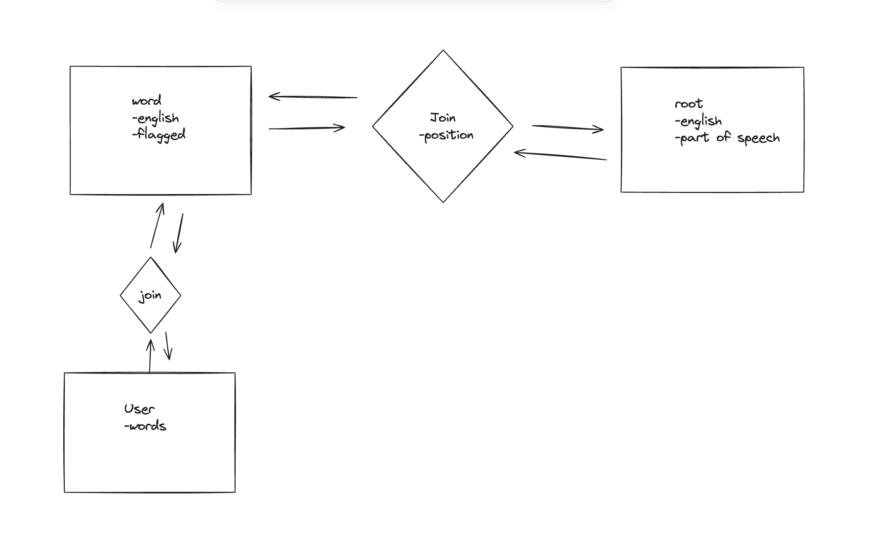

# Szótő Szőni

- Prioritizes root relationships to teach agglutinative languages in a more intuitive way
- Leverages AI to create content for difficult agglutinative languages like Hungarian, which lack resources for learning

## Demo

Roots and words are connected using a custom join table storing the position of the root. Words are rendered as a sequence of roots, with tooltips and highlights corresponding to each root's part-of-speech.

