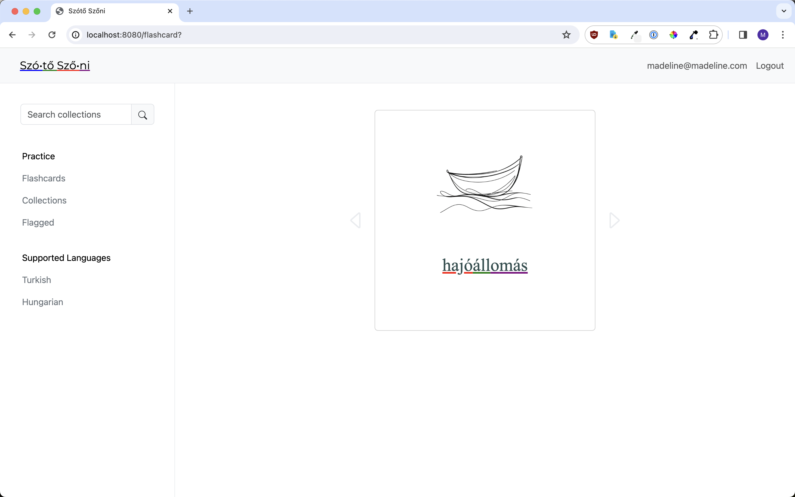
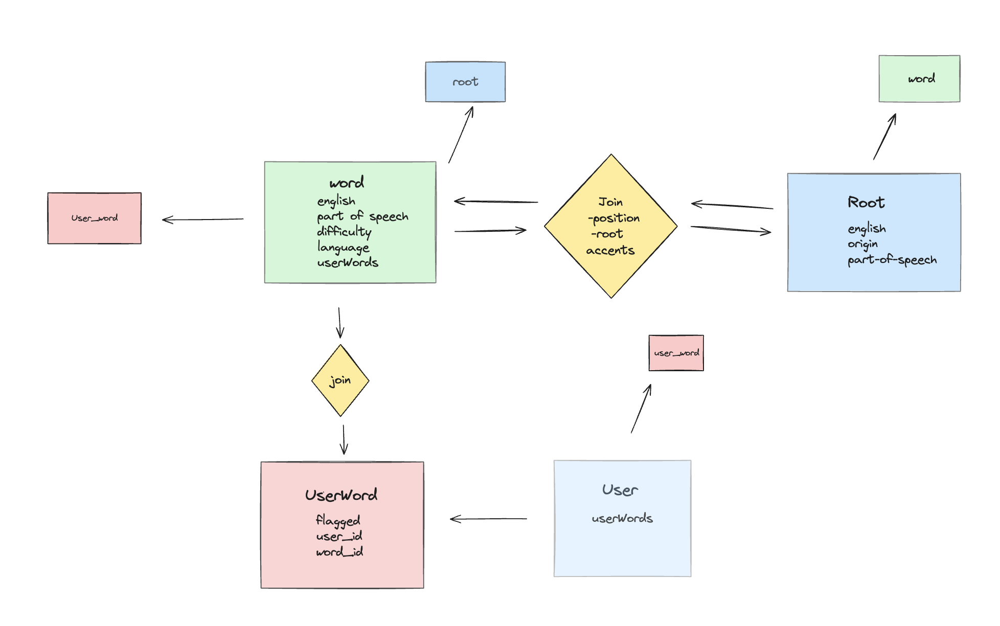

# Szótő Szőni

### Mission

Szótő Szőni leverages AI to create content for difficult agglunative (suffix-based) languages lacking resources for learning. The app currently supports Turkish and Hungarian, but advances in AI create potential to support more endangered agglutinative languages like Circassian and Uyghur.

### Creative UX makes words easier to memorize

AI breaks down words into color-highlighted roots to create associations between words, their part-of-speech, and root formations.

### Comparative approach to language learning

Flashcards give learners a complete root breakdown with translation and part-of-speech for easy comparison with previously seen words. Origin is also provided to allow learners to relate roots to other agglutinative or Central Asian linguistic groups.

### Data structure

A custom join table connects words and roots by storing the position of the root and word dependent accents and fusions. Words are rendered as a sequence of roots, with tooltips and highlights corresponding to each root's part-of-speech.

